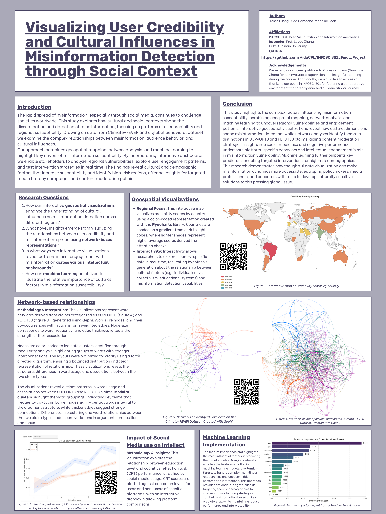

# **Visualizing User Credibility and Cultural Influences in Misinformation Detection Repository**

## Project Information

- **Author**: Tessa Luong, Aida Camacho Ponce de Leon, Shouzhifan Zhu

- **Instructor**: Professor Luyao Zhang, Duke Kunshan University

- **Disclaimer**: Submissions to the Final Project for INFOSCI 301: Data Visualization and Information Aesthetics at Duke Kunshan University.

- **Acknowledgments**: We extend our sincere gratitude to Professor Luyao (Sunshine) Zhang for her invaluable supervision and insightful teaching during the INFOSCI 301 course. Her guidance and support were instrumental in shaping the development of this project. Additionally, we would like to express our thanks to our peers in INFOSCI 301 for fostering a collaborative environment that greatly enriched our educational journey.

- **Project Summary**:
<p align="center">
  <kbd>
    
  </kbd>
</p>

*Figure 1: Map of the research proposal. Created with Whimsical*

## **Table of Contents**
* [Overview](./README.md#Overview)
* [Repository Structure](./README.md#Repository-Structure)
* [Key Features](./README.md#Key-Features)
* [Datasets](./README.md#Datasets)
* [Applications](./README.md#Applications)
* [Getting Started](./README.md#Getting-Started)
* [Final Poster](./README.md#Final-Poster)
* [Contributing](./README.md#Contributing)
* [License](./README.md#License)
* [References](./README.md#References)


## **Overview**

This repository focuses on research aimed at visualizing user credibility and cultural influences in misinformation detection through social context. By leveraging advanced visualization techniques and integrating diverse datasets, this project provides actionable insights into the dynamics of misinformation spread, detection, and user behavior across cultural boundaries. The visual tools developed here address key societal challenges, empowering stakeholders across disciplines to combat the global issue of misinformation.

---

## **Repository Structure**

- **[`Data/`](Data/README.md)**: Contains the datasets used in the project, including:
  - **Climate-FEVER**: Validated climate-related claims with evidence annotations.
  - **Global Misinformation Dataset**: Behavioral and demographic data from 16 countries.
- **[`Code/`](Code/README.md)**: Python scripts for data preprocessing, integration, and visualization.
   - **`data_preprocessing.ipynb`**: Scripts for loading and aligning datasets.
   - **`visualization_tools.py`**: Functions for creating static and interactive visualizations.
   - **`machine_learning.ipynb`**: Includes machine learning pipelines and SHAP analysis.
   - **`/map`**: HTML file for the geospatial map that one can download and run on browser.
- **[`Results/`](Results/README.md)**: Output visualizations and analysis results.
---

## **Key Features**

- **Data Integration**:
  - Combines multiple datasets to explore misinformation across regions, platforms, and cultural contexts.
  - Aligns schemas for consistency and scalability in analysis.
- **Interactive Visualizations**:
  - Scatterplots for misinformation amplification patterns.
  - Network diagrams for dissemination pathways.
  - Choropleth maps for regional vulnerability analysis.
---

## **Datasets**

### **Climate-FEVER**
- Focuses on climate-related misinformation with claim-evidence annotations categorized as SUPPORTS, REFUTES, or NOT_ENOUGH_INFO.

### **Global Misinformation Dataset**
- Behavioral data from 16 countries, capturing demographic influences on misinformation perception.

---

## **Applications**

1. **Policy Development**:
   - Identify misinformation hotspots and track the effectiveness of interventions.
   - Design culturally sensitive campaigns targeting misinformation-prone regions.

2. **Media and Journalism**:
   - Tailor fact-checking strategies based on audience demographics.
   - Monitor and visualize the impact of fact-checking efforts.

3. **Academic Research**:
   - Explore correlations between cultural factors and misinformation susceptibility.
   - Analyze temporal trends and the role of social context in misinformation acceptance.

4. **Social Media Platforms**:
   - Enhance content moderation strategies using clustering and network analysis.
   - Develop user-specific interventions to mitigate misinformation spread.

5. **Education and Media Literacy**:
   - Create engaging, data-driven materials to teach critical thinking and media literacy.
   - Design programs tailored to regional misinformation vulnerabilities.

6. **NGO Advocacy**:
   - Demonstrate the societal impact of misinformation to secure resources.
   - Guide the development of cross-cultural programs improving information literacy.

---

## **Getting Started**

### **Prerequisites**
- Python 3.6 or higher
- Required libraries:
  - `pandas`
  - `numpy`
  - `matplotlib`
  - `networkx`
  - `flask`
  - `shap`

### **Installation**
Clone the repository and install dependencies:

```bash
git clone https://github.com/AidaCPL/INFOSCI301_Final_Project.git
cd misinformation-visualization
pip install -r requirements.txt
```

### **Usage**
1. **Preprocess Data**:
   ```bash
   python scripts/data_preprocessing.ipynb
   ```
2. **Generate Visualizations**:
   ```bash
   python scripts/visualization_tools.py
   ```
---
## **Final Poster**
<p align="center">
  <kbd>
    
  </kbd>
</p>
---

## **Contributing**
We welcome contributions to enhance the repository. Please submit issues or pull requests to suggest improvements or report bugs.

---

## **License**
This project is licensed under the MIT License. See the [LICENSE](LICENSE) file for details.

---

## **References**
This project builds upon datasets and methodologies outlined in:
- Climate-FEVER: [Dataset Paper](https://arxiv.org/abs/2005.00857)
- Global Misinformation Dataset: [Understanding and combatting misinformation across 16 countries on six continents](https://doi.org/10.1038/s41562-023-01641-6)
